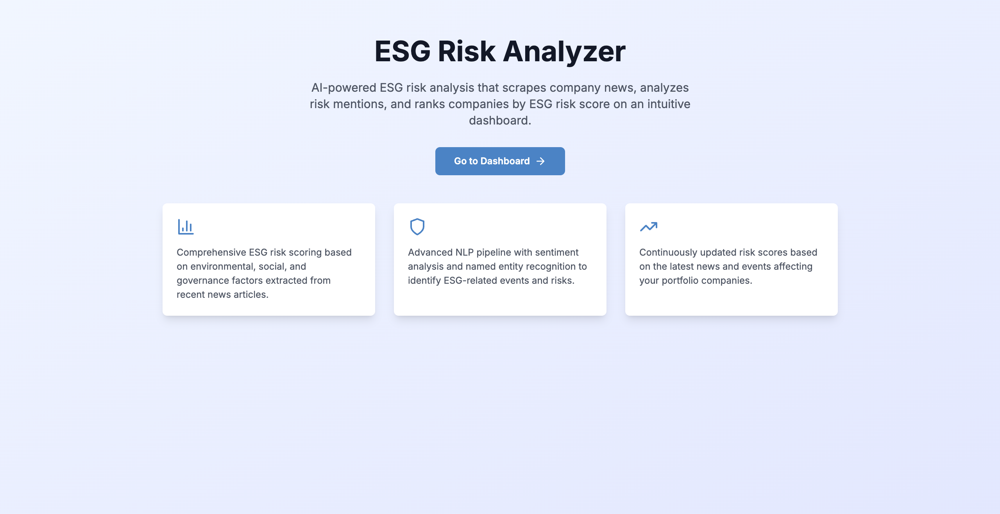
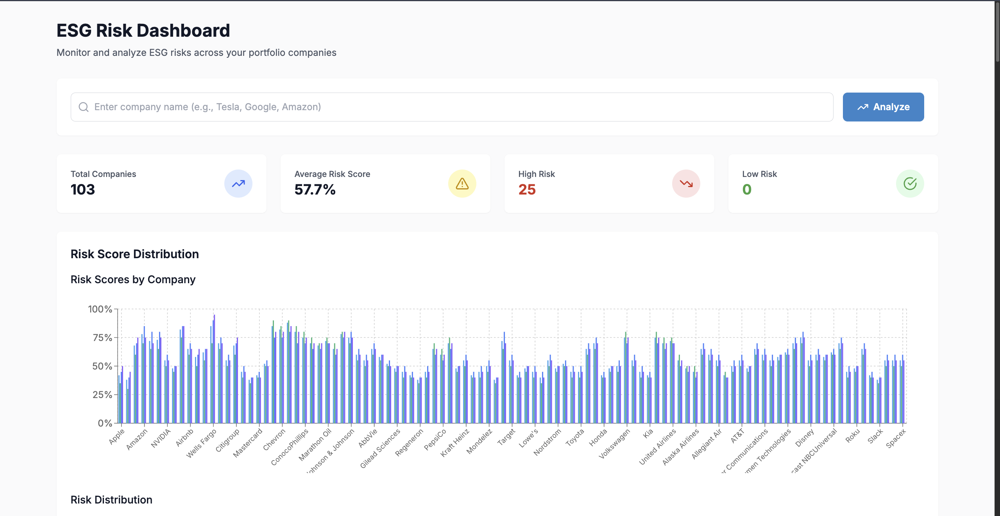
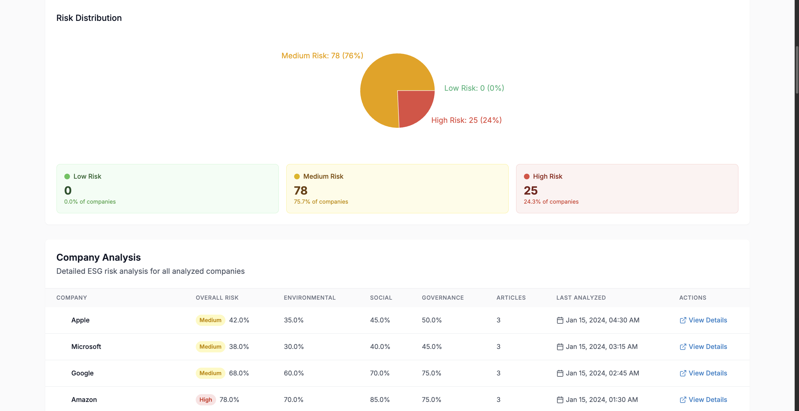

# ESG Risk Analyzer

An AI-powered ESG (Environmental, Social, Governance) risk analyzer that scrapes company news, analyzes risk mentions with NLP, and ranks companies by ESG risk score on an intuitive dashboard.

## What It Does

- **News Analysis**: Scrapes (or mocks) recent news articles about companies
- **AI-Powered NLP**: Uses sentiment analysis and named entity recognition to detect ESG-related events
- **Risk Scoring**: Computes comprehensive ESG risk scores based on environmental, social, and governance factors
- **Interactive Dashboard**: Visualizes risk data with charts, tables, and detailed company breakdowns
- **Real-time Updates**: Continuously analyzes new articles and updates risk scores

## Tech Stack

### Backend
- **FastAPI** - Modern Python web framework
- **SQLAlchemy** - Database ORM
- **SQLite** - Lightweight database
- **spaCy** - Natural language processing
- **TextBlob** - Sentiment analysis
- **BeautifulSoup4** - Web scraping (for future implementation)

### Frontend
- **Next.js 14** - React framework
- **TypeScript** - Type safety
- **Tailwind CSS** - Utility-first styling
- **Recharts** - Data visualization
- **Axios** - HTTP client

### Infrastructure
- **Docker** - Containerization
- **Docker Compose** - Multi-container orchestration

## Quick Start

### Prerequisites
- Docker and Docker Compose installed
- Git

### 1. Clone the Repository
```bash
git clone <repository-url>
cd Ecoscope
```

### 2. Run with Docker Compose
```bash
docker-compose up --build
```

This will:
- Build and start the FastAPI backend on `http://localhost:8000`
- Build and start the Next.js frontend on `http://localhost:3000`
- Seed the database with sample data for 5 companies

### 3. Access the Application
- **Frontend Dashboard**: http://localhost:3000
- **Backend API**: http://localhost:8000
- **API Documentation**: http://localhost:8000/docs

## Features

### Dashboard
- **Company Search**: Analyze any company by name
- **Risk Overview**: Visual charts showing risk distribution
- **Company Table**: Sortable table with expandable details
- **Real-time Analysis**: Get instant ESG risk scores

### Risk Analysis
- **Environmental**: Carbon emissions, pollution, sustainability
- **Social**: Labor disputes, workplace safety, human rights
- **Governance**: Regulatory fines, lawsuits, corruption

### Data Visualization
- **Bar Charts**: Compare risk scores across companies
- **Pie Charts**: Risk distribution overview
- **Interactive Tables**: Detailed company breakdowns

## API Endpoints

### Analyze Company
```http
GET /api/analyze?company=Tesla
```

**Response:**
```json
{
  "company": "Tesla",
  "score": 0.73,
  "risk_breakdown": {
    "overall_score": 0.73,
    "environmental_score": 0.65,
    "social_score": 0.80,
    "governance_score": 0.75
  },
  "events": [
    {
      "event_type": "social_labor_strike",
      "description": "Tesla is facing renewed labor disputes...",
      "severity": 0.8
    }
  ],
  "articles": [...],
  "total_articles": 3,
  "analyzed_at": "2024-01-15T10:30:00Z"
}
```

### Get All Companies
```http
GET /api/companies
```

### Get Company Details
```http
GET /api/companies/{company_id}/details
```

## Development Setup

### Backend Development
```bash
cd backend
pip install -r requirements.txt
python -m spacy download en_core_web_sm
python seed_data.py
uvicorn app.main:app --reload
```

### Frontend Development
```bash
cd frontend
npm install
npm run dev
```

## Project Structure

```
Ecoscope/
├── backend/
│   ├── app/
│   │   ├── __init__.py
│   │   ├── main.py              # FastAPI application
│   │   ├── database.py          # Database models and connection
│   │   ├── models.py            # Pydantic models
│   │   ├── routers/
│   │   │   └── analyze.py       # API routes
│   │   └── services/
│   │       ├── nlp_service.py   # NLP processing
│   │       └── news_service.py  # News scraping/mocking
│   ├── requirements.txt
│   ├── Dockerfile
│   └── seed_data.py            # Database seeding
├── frontend/
│   ├── app/
│   │   ├── dashboard/
│   │   │   └── page.tsx         # Main dashboard
│   │   ├── globals.css
│   │   ├── layout.tsx
│   │   └── page.tsx             # Landing page
│   ├── components/
│   │   ├── CompanyTable.tsx     # Company data table
│   │   └── RiskChart.tsx        # Data visualization
│   ├── services/
│   │   └── api.ts               # API client
│   ├── package.json
│   └── Dockerfile
├── docker-compose.yml
└── README.md
```

## Screenshots
<p align="center">
  
  
  
</p>


## How It Works

### 1. News Collection
- Scrapes recent news articles about the target company
- Currently uses mock data for demonstration
- Easily extensible to real news APIs

### 2. NLP Processing
- **Sentiment Analysis**: Determines article sentiment (-1 to 1)
- **Named Entity Recognition**: Identifies ESG-related keywords
- **Event Detection**: Categorizes events by type and severity

### 3. Risk Scoring
- **Environmental**: Emissions, pollution, sustainability issues
- **Social**: Labor disputes, workplace safety, human rights
- **Governance**: Regulatory fines, lawsuits, corruption
- **Overall Score**: Weighted combination of all factors

### 4. Data Storage
- SQLite database with SQLAlchemy ORM
- Stores companies, articles, events, and risk scores
- Supports historical tracking and trend analysis

## Future Enhancements

- **Real News APIs**: Integration with news services (NewsAPI, Google News)
- **Advanced NLP**: Custom ESG-specific models
- **Portfolio Management**: Track multiple companies
- **Alerts**: Risk threshold notifications
- **Historical Analysis**: Trend tracking over time
- **Export Features**: PDF reports, CSV exports
- **User Authentication**: Multi-user support
- **API Rate Limiting**: Production-ready scaling

## Contributing

1. Fork the repository
2. Create a feature branch (`git checkout -b feature/amazing-feature`)
3. Commit your changes (`git commit -m 'Add amazing feature'`)
4. Push to the branch (`git push origin feature/amazing-feature`)
5. Open a Pull Request

## License

This project is licensed under the MIT License - see the [LICENSE](LICENSE) file for details.

## Support

If you encounter any issues or have questions:

1. Check the [Issues](https://github.com/your-repo/issues) page
2. Create a new issue with detailed information
3. Include error logs and steps to reproduce

## Acknowledgments

- Built with FastAPI and Next.js
- NLP powered by spaCy and TextBlob
- UI components with Tailwind CSS
- Data visualization with Recharts
